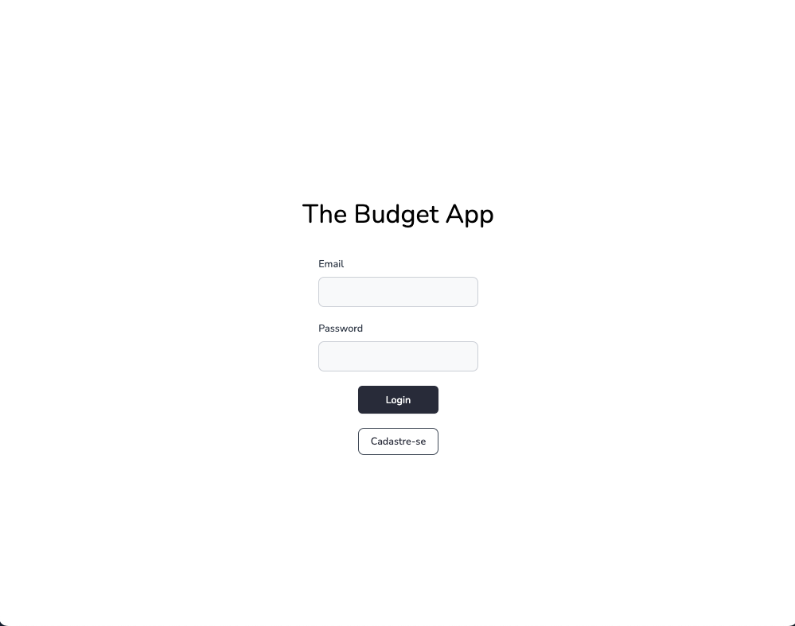
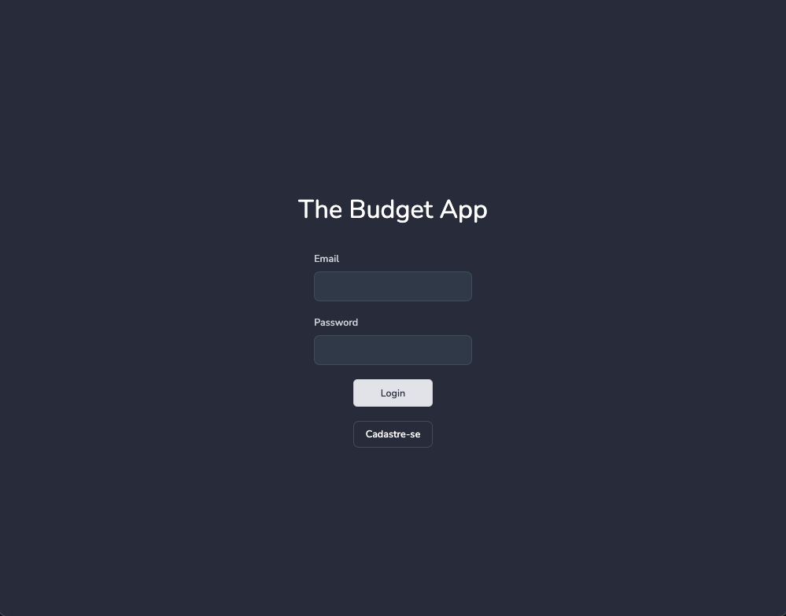
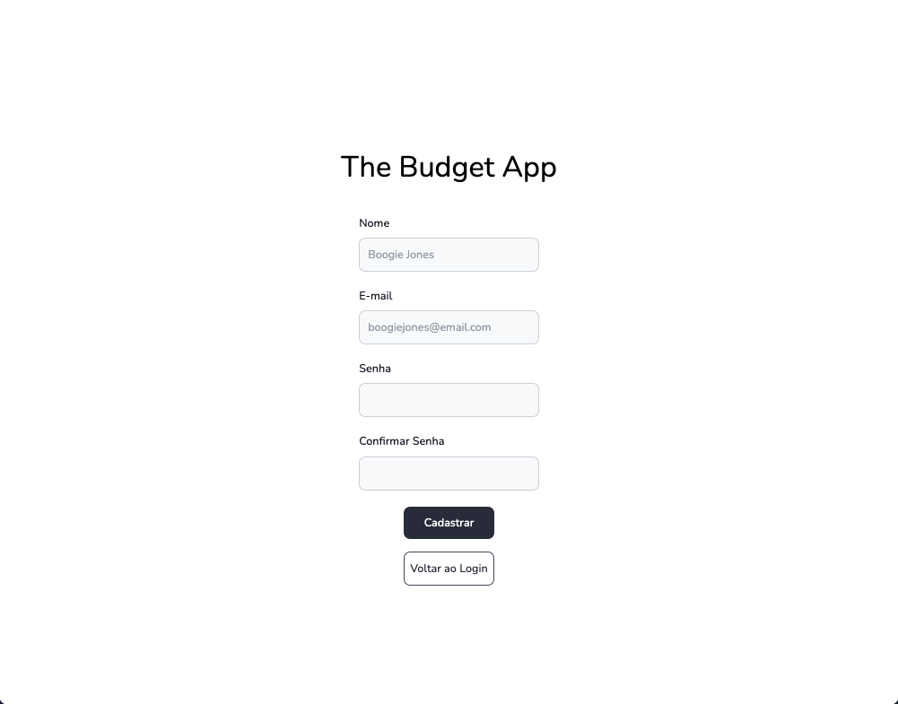
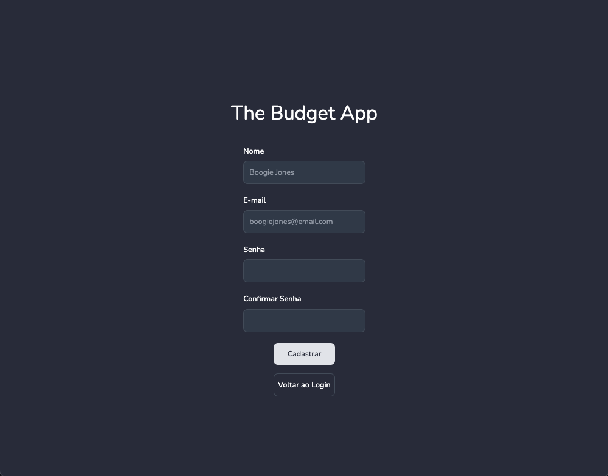
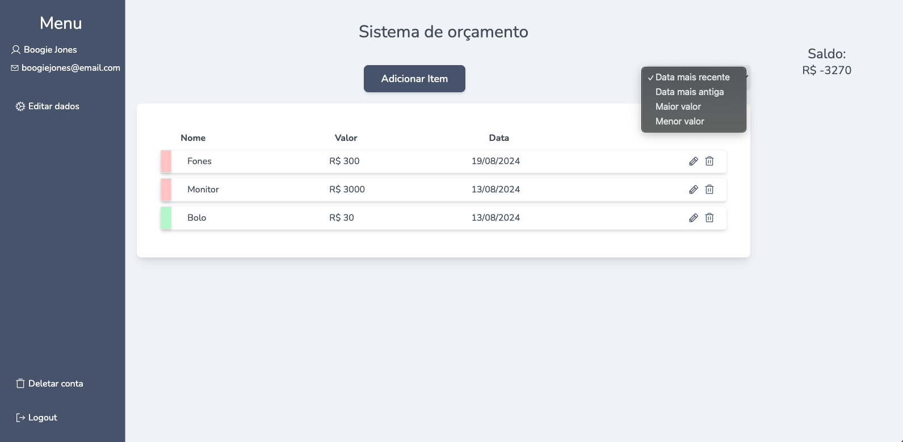
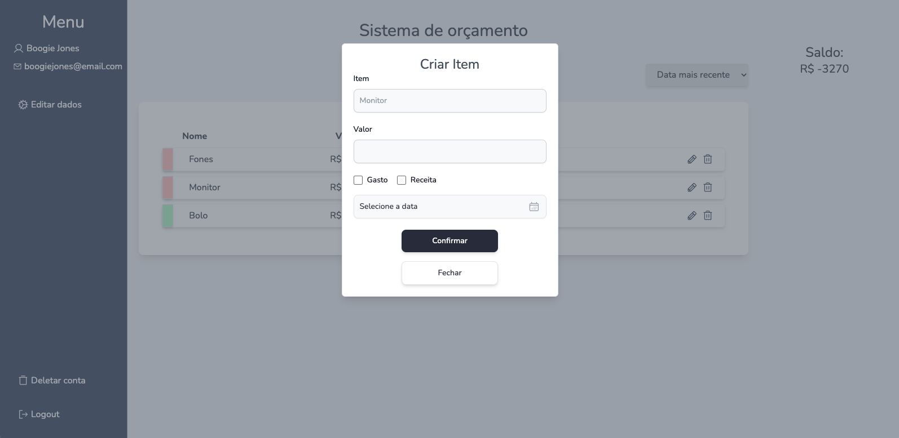
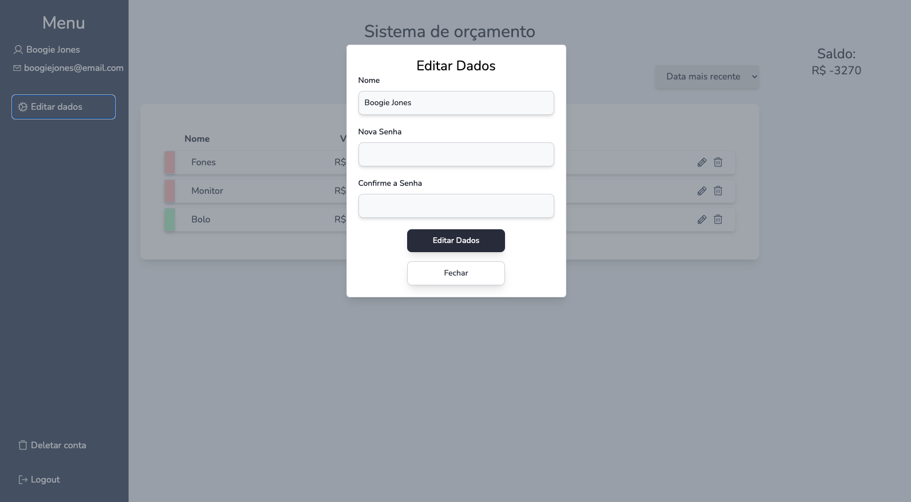
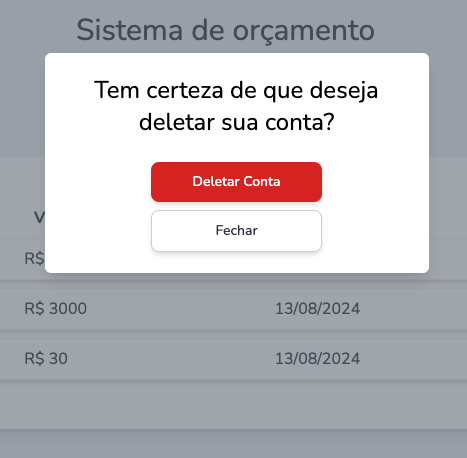
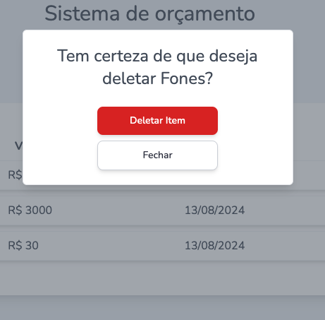

# The Budget App - Front-End

## O que é necessário para testar essa aplicação?

- Ter o [Node.js](https://nodejs.org/en) instalado na versão 21.4.0 ou acima;
- Ter o gerenciador de pacotes [NPM](https://www.npmjs.com/) instalado;

## Telas

### Login

#### Modo Diurno



#### Modo Noturno



### Cadastro

#### Modo Diurno



#### Modo Noturno



### Dashboard

#### Seleção de Filtros



#### Criar ou Editar Item



#### Editar Dados do Usuário



#### Deletar Usuário



#### Deletar Item



## Tecnologias utilizadas

- [NextJS](https://nextjs.org/)
- [TypeScript](https://www.typescriptlang.org/)
- [TailwindCSS](https://tailwindcss.com/)
- [Day.js](https://day.js.org/)
- [React Tailwind Datepicker](https://react-tailwindcss-datepicker.vercel.app/)

## Funcionalidades

### Usuário

**Cadastro de Usuários:**

- [x] Nome do Usuário;
- [x] Email do Usuário;
- [x] Senha do Usuário;

**Login de Usuários:**

- [x] Email do Usuário;
- [x] Senha do Usuário;

**Atualização de Cadastro dos Usuários:**

- [x] Nome do Usuário;
- [x] Senha do Usuário;

### Dashboard

- [x] Visualização de todos os Itens do Usuário;
- [x] Cadastrar Item do Usuário;

  - Nome do Item;
  - Valor do Item;
  - Tipo de Item (Receita ou Despesa);
  - Data do Registro;

- [x] Atualizar Item;

  - Nome do Item;
  - Valor do Item;
  - Tipo de Item (Receita ou Despesa);
  - Data do Registro;

- [x] Deletar Item;

## Como rodar o Projeto

Clone o projeto

```bash
  git clone https://github.com/egMarshall/the_budget_front
```

Entre no diretório do projeto

```bash
  cd the_budget_front
```

### Rodando com o Docker

```bash
  docker-compose up -d
```

### Rodando Localmente

Utilize a versão correta do NPM

```bash
  nvm use default
```

Instale as dependências

```bash
  npm i
```

Inicie o projeto

```bash
  npm run dev
```

## Guia de Estilos do Projeto

### Documentação de cores

| Cor                | Hexadecimal                                                      |
| ------------------ | ---------------------------------------------------------------- |
| Primary Background |  #EFEDE7 |
| Menu Background    |  #4F5D75 |
| Primary Title      |  #2D3142 |
| Primary Subtitle   |  #BFC0C0 |

### Documentação de Fontes

| Nome   | Tipo     | Peso |
| ------ | -------- | ---- |
| Nunito | **Bold** | 700  |
| Nunito | Regular  | 400  |
| Nunito | Light    | 300  |
